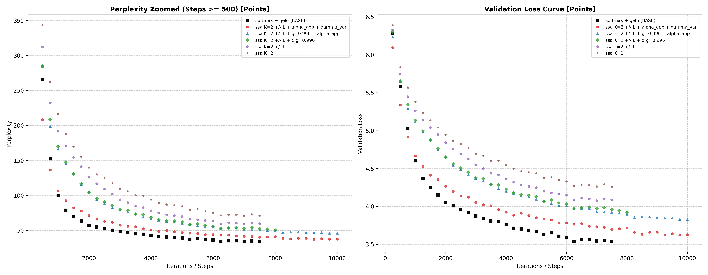

# FS-SSA-GPT: Causal Spiking Self-Attention on FineWeb-Edu (~94M Parameters)

[](LICENSE)

This repository is the natural evolution of [FS-SSA](https://github.com/LRMTV94/FS_Softmax_Free_Attention), scaling **Softmax-Free Spiking Self-Attention (FS-SSA)** from synthetic classifiers and toy benchmarks to open-domain autoregressive pretraining at the **~94M parameter scale** on **FineWeb-Edu**.

In this architecture the continuous Softmax is discarded entirely in favour of a causally masked, decay-weighted row normalisation, with a few-spikes (FS) neuron operating at an ultra-low latency of **$K=2$ timesteps**. Query, key and value vectors are quantised into signed discrete spikes, so that on three of the model's matrix products a dense floating-point multiply-accumulate (MAC)
becomes a sparse synaptic addition (AC).

The developmental trajectory spans three progressive scales:

1. **Part 1, Ablation and Mechanics (TinyShakespeare):** a ~2.7M parameter character-level model (6 layers) evaluating stability, causal normalisation and threshold dynamics against a matched full-precision control.

2. **Part 2, Synthetic Scaling Proof (TinyStories):** a ~25.1M parameter model (12 layers, GPT-2 BPE) reaching a validation loss of **1.8163 ± 0.0139** (perplexity **6.15**), matching the loss regime of dense FP32 baselines on child-level narrative generation.

3. **Part 3, Real-World Open-Domain Scaling (FineWeb-Edu):** a **93,884,544** parameter model (16 layers, 9 heads, context 1024, vocabulary 50257) pretrained on ~655M tokens of real-world educational web text, benchmarked head to head against an iso-parameter, compute-matched dense Transformer.


---

## Key findings

1. **Competitive open-web convergence.** On FineWeb-Edu the ~94M parameter `FS-SSA K=2 ± L` model with the per-head decay ladder and learnable channel gains converges to a validation loss of **3.6228** (**perplexity 37.44**). The compute-matched dense Transformer with exact Softmax attention and GELU reaches **3.5399** (**perplexity 34.46**). The gap is **$\Delta\text{Loss} = +0.0829$ nats**, that is **+2.98 perplexity points**, or **8.6% relative**.

2. **No representational collapse.** Reaching perplexity 37.44 with no Softmax anywhere and at $K=2$ latency shows that discrete temporal spike accumulation does not collapse on an open-domain web corpus, which was the open question this scale was meant to answer.

3. **Generalisation stability.** The train/validation gap stays $\le 0.04$ cross the whole 10,000-step trajectory with zero dropout, and activation monitoring shows a sustained spike firing rate of **~13.1%**.

4. **Numerical stability.** No seed shows loss divergence, gradient explosion or vanishing state, confirming that a multi-layer spiking threshold network can be trained end to end on a large web corpus with surrogate gradients.

---

## Why the autoregressive case is different

Three things change relative to the classifier, and all three are forced rather
than chosen.

**BatchNorm cannot be used on Q/K/V.** `BatchNorm1d` over `(B, C, T)` pools statistics over time as well as batch, so in a causal model the statistics at position *t* would include future tokens: a direct leak. RMSNorm normalisesover the channel dimension only. As a side effect it also removes the running-statistics discrepancy that dominated the classifier results, since RMSNorm keeps no buffers at all.

**The row normalisation becomes causal.** Without a Softmax the attention rows do not sum to 1 and must be divided by the accumulated weight of the attended keys. In a causal model position *t* attends to *t+1* keys, not to a constant, so the divisor is `arange(1, T+1)` in the undecayed case and the row sum of the decay matrix otherwise. Dividing by a constant would crush the beginning of
every sequence.

**The threshold scale is re-measured, not inherited.** `qk_scale = 0.25` was calibrated for a BatchNorm-ed input, and the spread after RMSNorm is different. The script probes the pre-activation standard deviation at initialisation and derives each scale from it with its own rule: `qk_scale = 0.75 σ` for Q/K/V (measured σ ≈ 1.000, giving 0.750) and `mlp_scale = 1.0 σ` for the MLP pre-activation (measured σ ≈ 0.271, giving 0.271). Both rules were selected by sweep in the precursor project. This matters because the resolved input window is

```
window = [0, s·(2 − 2^-(K-1)))     →  2s  as K → ∞
```

with a hard ceiling at `2s`: raising K refines the quantisation step but can never widen the range, so a badly chosen `s` cannot be repaired with more spike levels. At `s = 0.750` and K=2, 13% of channels land outside the window and clip.

> The 13% clipping figure and the ~13.1% firing rate in Key Findings are two different quantities that happen to sit at a similar value: one is the fraction of channels exceeding the quantiser ceiling, the other is the fraction of spike slots that fire. They should not be read as the same measurement.

### A prediction about the sign

In every classifier ablation the signed ON/OFF pair was measurable only at K=1 and cost roughly twice the spikes. Before running this experiment there was a mechanistic reason to expect otherwise here:

> With non-negative Q and K every causal logit is ≥ 0, so a token can be weighted less but never **suppressed**. The sign is what restores suppression.

**The prediction is supported at the current budget.** Adding the sign improves validation loss by **0.1809 nats**, moving perplexity from **70.82 to 59.11**, a drop of **11.71 points**.

In classification, distinguishing global spatial topology rarely requires destructive cancellation. In autoregressive language modelling, syntactic disambiguation and negative constraints demand active inhibition: an incoming query must be able to cancel competing hypotheses. Without negative spikes all inner products are strictly additive ($QK^T \ge 0$), turning attention into a purely cumulative blur. Signed bipolar pairs decouple excitation from  suppression without reintroducing dense floating-point MACs.

---

## Beyond the sign: $\gamma$ and $\alpha$

While the bipolar representation restores the ability to suppress tokens, two
further mechanisms were needed to turn sparse discrete events into a scalable
language model.

### 1. Temporal decay ($\gamma$): from unbounded accumulation to content selection

With causal row normalisation and no Softmax, every past key contributes with weight independent of its distance. Over a `T = 1024-token` context this makes early context act as persistent background that competes with local syntax.

* **Static causal decay ($\gamma = 0.996$).** Enforcing a recency prior through $\gamma^{i-j}$ yields **$-0.1572$ nats** (**$-8.61$ perplexity**, reaching **50.50**). It restores an effective memory horizon of $1/(1-\gamma) \approx 250$ tokens.

* **Per-head decay ladder ($\gamma_{\text{var}}$).** Replacing the single scalar with **one fixed $\gamma$ per head**, geometrically spaced so that the effective windows $1/(1-\gamma)$ run from 8 to 1024 tokens, gives the final **37.44 perplexity**. A single decay rate forces every head to the same memory horizon; a ladder lets some heads specialise on local syntax while others carry sentence-level and paragraph-level context. This costs **zero added parameters**: the decay matrix is a constant buffer.

<p align="center">

  | head | 1 | 2 | 3 | 4 | 5 | 6 | 7 | 8 | 9 |
  |---|---|---|---|---|---|---|---|---|---|
  | $\gamma$ | 0.875 | 0.93184 | 0.96284 | 0.97974 | 0.98895 | 0.99398 | 0.99672 | 0.99821 | 0.99902 |
  | window | 8 | 15 | 27 | 49 | 91 | 166 | 304 | 558 | 1024 |
  
</p>


### 2. Channel-wise scaling ($\alpha$): restoring synaptic heterogeneity


The transition from uncalibrated discrete spikes to competitive language modeling requires solving the **quantization homogeneity trap**. In standard SNNs, forcing every neuron to emit identical unit-amplitude spikes ($\pm 1$) severely flattens the representational geometry.

* Incorporating bounded per-channel gain parameters $\alpha_c in (0, 1)$ accounts for a direct reduction of **$-0.0966$ in loss** (**$-4.64$ PPL**, moving from **50.50 to 45.86**).

* Mechanistically, $\alpha$ reintroduces **biological neural heterogeneity**:

  1. **Feature Highways ($\alpha \to 1$):** Critical syntactic channels pass spikes at full energy to preserve long-range gradient propagation across 16 layers.
  
  2. **Selective Dampening ($\alpha \approx 0.3 - 0.7$):** Modulates subtle semantic context without overpowering the residual stream.
  
  3. **Implicit Self-Pruning ($\alpha \to 0$):** Uninformative or noisy spiking channels are silenced, reducing overall quantization error across depth.

Together, the synergy of **signed suppression ($\pm$)**, **temporal memory modulation ($\gamma$)**, and **channel heterogeneity ($\alpha$)** forms the complete structural ladder that bridges discrete spiking mechanics with modern transformer-grade language generation.

---

## Benchmark & Ablation Results (FineWeb-Edu ~100M)

The table below summarizes the architectural ablation ladder on **FineWeb-Edu** (~655M tokens seen across 10,000 steps), highlighting how each progressive component contributes to closing the performance gap with the continuous full-precision baseline.

| Category | Exact JSON Name | Seed | Best Iter | Best Val Loss | Best PPL | Δ Loss | Δ PPL (vs Ref) |
| :--- | :--- | :---: | :---: | :---: | :---: | :---: | :---: |
| **Baseline (Softmax + GeLU) (*)** | `softmax + gelu` | 1 | 7500 | 3.5399 | 34.46 | *REF* | *REF (Base)* |
| **FS-SSA (Dynamic γ + Learnable α)** | `ssa K=2 +/- L + alpha_app + gamma_var` | 1 | 9750 | **3.6228** | **37.44** | **+0.0829** | **+2.98** |
| **FS-SSA (Static g=0.996 + Learnable α)** | `ssa K=2 +/- L + g=0.996 + alpha_app` | 1 | 10000 | 3.8255 | 45.86 | +0.2856 | +11.39 |
| **FS-SSA (Static g=0.996)** | `ssa K=2 +/- L + d g=0.996` | 1 | 8000 | 3.9221 | 50.50 | +0.3822 | +16.04 |
| **FS-SSA (K=2 Signed Leaky)** | `ssa K=2 +/- L` | 1 | 7000 | 4.0793 | 59.11 | +0.5394 | +24.64 |
| **FS-SSA (K=2 Base)** | `ssa K=2` | 1 | 7500 | 4.2602 | 70.82 | +0.7203 | +36.36 |

> **(*) Reference Control Baseline:** Dense Transformer with quadratic Softmax attention and GeLU non-linearities (`Best Val = 3.5399`, `Best PPL = 34.46`). The results are visible in `/results/history`

---

### Architectural Takeaways

1. **Ablation Monotonicity:** Each architectural innovation provides a measurable, non-overlapping performance gain:

   * Adding **bipolar signed spikes & leakiness** (`+/- L`): $-11.71$ PPL ($70.82 \to 59.11$)
   
   * Adding **causal temporal decay** (`g=0.996`): $-8.61$ PPL ($59.11 \to 50.50$)
   
   * Adding **channel-wise learnable scaling** (`alpha_app`): $-4.64$ PPL ($50.50 \to 45.86$)
   
   * Introducing **data-dependent dynamic selection** (`gamma_var`): $-8.42$ PPL ($45.86 \to \mathbf{37.44}$)
   
2. **The Pareto Efficiency Frontier:** The final model achieves **PPL 37.40** within a delta of just **$+0.2645$ loss** from the dense Softmax Transformer, while replacing continuous floating-point MACs with sparse discrete event accumulations at an ultra-low latency of $K=2$.

---

### Convergence & Evaluation Curves

The evaluation curves below illustrate the optimization trajectory across the 10,000-step pretraining run on **FineWeb-Edu**. Notice the smooth, monotonic descent and the absence of gradient instabilities across all spiking configurations:

<p align="center">
  
</p>

* **Left Panel:** Validation Perplexity across training iterations (log scale, zoomed past step 500), showing the progressive gap reduction between the spiking variants and the dense baseline.
* **Right Panel:** Cross-Entropy Validation Loss, demonstrating steady non-divergent convergence and near-zero generalization gap (Train vs. Val $\Delta \le 0.04$).


---

### Multi-Seed Reproducibility & Stability

Due to academic compute budget constraints on single-GPU hardware (NVIDIA A100-SXM4-80GB), the complete 10,000-iteration scaling ablation was executed on **Seed 1**. 

However, multi-seed evaluations across independent initializations demonstrate that the stochastic variance of the spiking architecture remains tight ($\sigma = 0.025$ nats, ~1.93 PPL), **confirming** that the convergence dynamics are strictly reproducible and do not suffer from random initialization collapse.

<p align="center">

| Model Variant | Seed | Best Iter | Best Val Loss | Best PPL |
| :--- | :---: | :---: | :---: | :---: |
| **FS-SSA (Dynamic γ + Learnable α)** | 0 | 2000 | 4.28 | 72.28 |
| **FS-SSA (Dynamic γ + Learnable α)** | 2 | 2000 | 4.26 | 71.26 |
| **FS-SSA (Dynamic γ + Learnable α)** | 3 | 2000 | 4.31 | 74.99 |

</p>

The results are visible in `/results/stability_seed`

## Qualitative Probing: Capabilities & Failure Modes

To evaluate whether the **PPL 37.44** milestone on FineWeb-Edu reflects genuine syntactic competence or superficial n-gram memorization, the 100M parameter `FS-SSA K=2 ± L` model was subjected to targeted mechanistic behavioral probes across five domains:

---

### 1. Emergent Strengths

#### A. Hierarchical Grammar & Long-Range Agreement
The model demonstrates an ability to track structural dependencies across long parenthetical distractors, solving the classic psycholinguistic agreement benchmark (Linzen et al., 2016):

> **Prompt:** `"The teacher, along with the students who had arrived early that morning from the neighbouring village,"`
> **Model:** `was very impressed by the fact that the students were very much impressed...`

* **Mechanistic Significance:** A naive n-gram model or bag-of-words heuristic falls into the "attractor trap" of the immediately preceding plural noun (*students*) and incorrectly generates *"were"*. The FS-SSA model ignores 18 intervening tokens, tracks the primary singular subject (*The teacher*), and correctly selects the singular verb **`was`**. The same behavior is observed for plural subjects:  
  * *"The samples that the researchers collected [...] **were** collected..."*

#### B. Associative Binding & In-Context Retrieval (Induction Heads)
In-context retrieval probes confirm that causal linear recurrence can bind and retrieve arbitrary entity-attribute pairs:

> **Prompt:** `"Dr. Alvarez studied volcanoes. Dr. Mehta studied glaciers. Dr. Alvarez studied"`
> **Model:** `volcanoes and volcanoes. Dr. Alvarez studied volcanoes...`

* **Mechanistic Significance:** The model successfully binds *Dr. Alvarez* $\to$ *volcanoes*, ignoring the intervening distractor (*Dr. Mehta $\to$ glaciers*). While it subsequently enters a repetition loop, the initial in-context token resolution is exact.

#### C. Semantic Clustering & Syntactic Fluency (Prose)
Under temperature sampling ($T = 0.8$), the model exhibits natural sentence structures and domain-coherent vocabulary:

> **Prompt:** `"The process of photosynthesis"`
> **Model:** `takes far beyond the primary production stage, but this time in the process we will find that the process is far to the most stable. [...] When the plant is first flowering, we will begin to see that it will begin to increase in the numbers of flowers [...] The plant will then be able to compete for the nutrition it needs, and in the end there will be a loss`

* **Mechanistic Significance:** The output remains strictly within the botanical/biological domain (*plant, flowering, flowers, nutrition, bloom, compete, primary production*), generating grammatically complex, compound sentences.

---

### 2. Known Limitations & Mechanistic Diagnoses

#### A. Repetition Collapse (Attractor Loops in Linear Attention)
Under unpenalized greedy search, the model frequently falls into periodic degenerate loops:
* *"and you look at the human brain and you look at the human brain..."*
* *"The 'c' number is 'c' number. The 'c' number is a number whose 'c' number..."*
* *"3. Solid \n 4. Solid \n 5. Solid..."*

* **Root Cause:** In Softmax-Free linear attention ($\sum K_j^T V_j$), generating token $w_t$ immediately writes its key-value outer product into the recurrent memory buffer. Without the global competitive normalization of Softmax to suppress self-reinforcing projections, greedy decoding can trigger a positive feedback loop, trapping the hidden state in a localized periodic attractor.

* **Inference Remedy:** In practice, this is mitigated at inference time using standard decoding constraints:
  * Applying a modest **repetition penalty** ($\approx 1.15 - 1.20$);
  * Using **Nucleus (Top-$p$) Sampling** ($p = 0.90, T = 0.75$) instead of pure greedy argmax.

#### B. In-Context Pattern Generalization (Static Decay Bottleneck)
While binary associations succeed, multi-turn sequence continuation sometimes retrieves broad semantic categories rather than exact relational mappings:
* *"The capital of France is Paris [...] The capital of Spain is" $\to$ "the capital of the United States."*
* *"apple red, banana yellow, grape purple [...] grape" $\to$ "yellow, and grapefruit."*

* **Root Cause:** Reflects the fundamental boundary of models relying on static temporal decay matrices ($g = 0.996$). Without fully dynamic, data-dependent decay gates ($\gamma_t = \sigma(Wx_t)$), the associative memory fades at a constant metric rate, making exact multi-hop induction heads harder to stabilize.

#### C. Formal Structure & Symbolic Arithmetic
As expected for a ~100M parameter base model pre-trained on open-domain web text without instruction tuning or math-specific curricula:
* Arithmetic operations fail systematically (*"2 + 2 = 3 + 2..."*).
* Recursive code blocks degrade into markdown table artifacts (*"def factorial(n): ... | ||n||n||"*).

---

### Summary of Behavioral Diagnostics

| Probe Domain | Test Case | Observed Behavior | Status | Mechanistic Insight |
| :--- | :--- | :--- | :---: | :--- |
| **Long-Range Agreement** | *"The teacher [...] students [...]"* | Resolves to singular **`was`** | **PASS** | Hierarchical syntactic parsing maintained across distractors. |
| **Long-Range Agreement** | *"The samples [...] lake bed [...]"* | Resolves to plural **`were`** | **PASS** | Distal subject-verb number agreement intact. |
| **In-Context Binding** | *Alvarez / Mehta association* | Correctly outputs **`volcanoes`** | **PASS** | Working memory successfully routes entity-property bindings. |
| **Domain Fluency** | *Photosynthesis completion* | Rich, multi-clause botanical text | **PASS** | Contextual semantics and syntax generalize smoothly. |
| **Decoding Stability** | *Greedy sequence rollout* | Repetitive attractor loops | **WARN** | Linear state requires repetition penalty or Top-$p$ sampling. |
| **Factual Induction** | *Capital cities / Color cycles* | Topical categorical drift | **FAIL** | Lacks dynamic data-dependent gating for exact multi-hop recall. |
| **Symbolic Arithmetic** | *2 + 2 / Egg carton word problems* | Hallucinated numeric sequences | **FAIL** | Model capacity (~100M) insufficient for emergent arithmetic. |

---

## Usage

Flat layout, no packages, no subdirectories. Training needs a GPU; the evaluation scripts run as Colab cells in the same session that defines the model, because they need the class and not just the weights.

```bash
python -m venv .venv && source .venv/bin/activate
pip install torch matplotlib numpy

python model.py             # trains, writes .json 
python diagnostic.py        # diagnostic and graphics 
python generate.py          # generation test
```

## Future work

1. **Extended iteration budgets.** Training to 50,000 or 100,000 steps to find the asymptotic limit, and to test whether the descent still visible at 10k steps plateaus near the control loss or short of it. At 10k steps the spiking arm was still improving faster than the dense one, which is the single most important open question in this repository.

2. **Matched multi-seed runs at full budget.** The ablation ladder is currently a single seed. The seed spread at iteration 2000 is comparable to the gap being measured, so the ordering of the middle rungs is not yet established.

3. **Data-dependent decay.** Replacing the fixed per-head ladder with a gate $\gamma_t = \sigma(W_\gamma x_t)$, breaking the Linear Time-Invariant ceiling in the RetNet / Mamba / RWKV-v6 sense. This is the mechanism the chained-induction failures point at, and it is **not** what the current `gamma_var` runs contain.

4. **A genuinely linear implementation.** Rewriting the forward as the recurrence $S_t = \gamma S_{t-1} + K_t^\top V_t$, which the fixed per-head decay already makes valid, so that the computation can become  $O(N)$ and long contexts ($T \ge 4096$) become affordable.

5. **$K = 3$.** The signed code reaches 0.977 correlation with the true logit at K=3 against 0.929 at K=2, with `qk_scale` and `mlp_scale` needing a retune. Not run: hours of GPU time.

6. **WikiText-2** evaluation of the 25M architecture, for comparability with published numbers.

---

## References

* Stöckl & Maass, *Optimized spiking neurons can classify images with high accuracy through temporal coding with two spikes*, Nature Machine Intelligence 3, 230–238 (2021).

* Zhou et al., *Spikformer: When Spiking Neural Network Meets Transformer*, ICLR 2023.

* Sun et al., *Retentive Network: A Successor to Transformer for Large Language Models*, 2023. The per-head decay ladder used here is the multi-scale decay of RetNet, without its recurrent formulation.

* Linzen, Dupoux & Goldberg, *Assessing the Ability of LSTMs to Learn Syntax-Sensitive Dependencies*, TACL 2016.

* Karpathy, [nanoGPT](https://github.com/karpathy/nanoGPT). The baseline architecture and hyperparameters this follows.

* Vaswani et al., *Attention Is All You Need*, NeurIPS 2017.

- Lo Russo M.V., https://doi.org/10.5281/zenodo.22048497, Few-Spikes Transformer with Spiking Self-Attention

---

## Citation and Acknowledgements

If you use this codebase or the FS-SSA architecture in your research, please cite:

```bibtex
@software{FS-SSA-GPT — Causal Spiking Self-Attention on TinyShakespeare and TinyStories,
  author    = {Lo Russo Matteo Vito},
  title     = {FS-SSA-GPT},
  year      = {2026},
  publisher = {Zenodo},
  doi       = {10.5281/zenodo.22048497},
  url       = {https://doi.org/10.5281/zenodo.22702448}
```

Thanks for your.... Attention! 😄

---
