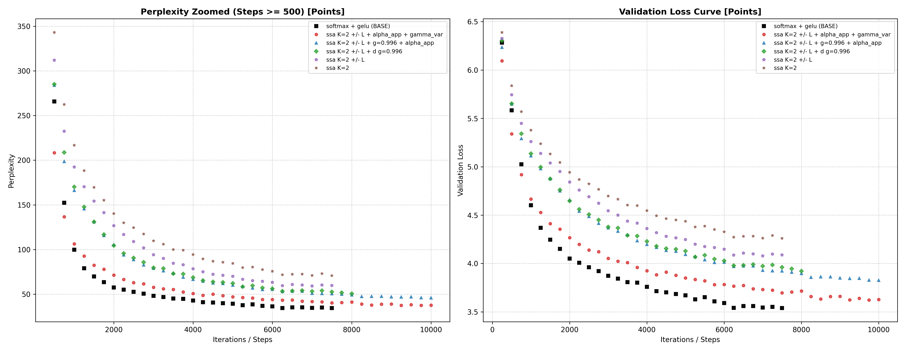

# FS²-SSA: Few-Spike, Softmax-Free Spiking Self-Attention

**A causal spiking language model on FineWeb-Edu (~94M parameters), with no softmax anywhere and an exact linear recurrence for inference.**

[](LICENSE)
[](https://doi.org/10.5281/zenodo.22950217)
[](https://huggingface.co/Matt-94/FS-SSA-LM-100M)

In this architecture the continuous Softmax is discarded entirely in favour of a causally masked, decay-weighted row normalisation. Query, key and value vectors are coded by few-spike (FS) neurons at an ultra-low latency of **$K=2$ timesteps**, as signed discrete spikes, so that three of the model's matrix products turn a dense floating-point multiply-accumulate (MAC) into a sparse synaptic addition (AC).

The square in the name stands for the two FS of the design: **few-spike** coding and **softmax-free** attention. In file names and code it is written `FS2-SSA`.

This repository is the natural evolution of [FS-SSA](https://github.com/LRMTV94/FS_Softmax_Free_Attention), scaling softmax-free spiking self-attention from synthetic classifiers and toy benchmarks to open-domain autoregressive pretraining.

---

## Development trajectory

1. **Part 1, Ablation and Mechanics (TinyShakespeare):** a ~2.7M parameter character-level model (6 layers) evaluating stability, causal normalisation and threshold dynamics against a matched full-precision control.

2. **Part 2, Synthetic Scaling Proof (TinyStories):** a ~25.1M parameter model (12 layers, GPT-2 BPE) reaching a validation loss of **1.8163 ± 0.0139** (perplexity **6.15**), matching the loss regime of dense FP32 baselines on child-level narrative generation.

3. **Part 3, Real-World Open-Domain Scaling (FineWeb-Edu, v1):** a **93,884,544** parameter model (16 layers, 9 heads, context 1024, vocabulary 50257) pretrained on ~655M tokens of educational web text, benchmarked head to head against an iso-parameter, compute-matched dense Transformer. Full report in [docs/v1.md](docs/v1.md).

4. **Part 4, Linear-time inference (v2, this release):** the same trained model, run as an exact recurrence with a fixed state per head, so that every new token costs the same however many came before.

---

## Key results

| model | validation loss | perplexity |
| :--- | :---: | :---: |
| Dense Transformer, Softmax + GELU (reference) | 3.5399 | 34.46 |
| **FS-SSA, $K=2$, signed, per-head decay ladder, learnable $\alpha$** | **3.6228** | **37.44** |

1. **Competitive open-web convergence.** The gap to the dense control is **$\Delta\text{Loss} = +0.0829$ nats**, that is **+2.98 perplexity points**, or **8.6% relative**. An independent verification run under identical settings reached **3.6147 (perplexity 37.14)**; the weights on Hugging Face are that checkpoint.

2. **No representational collapse.** Perplexity 37.44 with no Softmax anywhere and at $K=2$ latency shows that discrete temporal spike accumulation does not collapse on an open-domain web corpus.

3. **Generalisation and numerical stability.** The train/validation gap stays $\le 0.04$ across the whole 10,000-step trajectory with zero dropout, the sustained spike firing rate is **~13.1%**, and no run showed loss divergence, gradient explosion or vanishing state.

4. **Exact linear recurrence (v2).** On the published checkpoint, with no retraining, the parallel and the recurrent forms of the attention agree to a relative difference of **6e-16** in float64, with the same prediction on every token tested.

---

## What is new in v2: the attention as a recurrence

With a fixed decay $\gamma$ per head, the softmax-free attention is exactly a linear recurrence. The parallel form builds the $T \times T$ matrix

$$o_t = \frac{\text{scale}}{Z_t} \sum_{j \le t} \gamma^{t-j} \, (q_t \cdot k_j) \, v_j$$

and the recurrent form carries a state of fixed size instead:

$$S_t = \gamma \, S_{t-1} + k_t^\top v_t, \qquad Z_t = \gamma \, Z_{t-1} + 1, \qquad o_t = \text{scale} \cdot \frac{q_t S_t}{Z_t}$$

with $S_t$ of size $64 \times 64$ per head. The parallel form is kept for training, where a GPU computes it in one pass; the recurrent form is used for inference.

| check on the published checkpoint | result |
| :--- | :--- |
| logits, float64, 2 x 1024 tokens | relative difference **6e-16**, same argmax on every token |
| logits, float32, 2 x 1024 tokens | same argmax on **95.2%** of the tokens |
| validation loss, float32, 10 batches | **3.65808** parallel, **3.65814** recurrent |
| state of the whole model | 16 layers x 9 heads x 64 x 64, about **590 thousand values**, at any length |

In float64 the two forms agree to rounding. In float32 they round differently, and a spike whose input sits within rounding distance of its threshold can fire in one form and not in the other. The change then travels along the sequence through the attention: it moves the top prediction on about one token in twenty, but not the loss, which is also a useful property for hardware that rounds differently from a GPU.

On a GPU, 256 new tokens take about 17 s in both forms: at that length the parallel form costs little. What the recurrent form changes is that every new token costs the same up to the full context, with a state that does not grow.

Every check is run by `recurrent_check.py` on the published checkpoint (step 9750, best validation loss 3.6147).

```python
model.set_recurrent(True)            # the whole sequence through the recurrence
logits, loss = model(x, y)
model.set_recurrent(False)           # back to the parallel form, for training

out = model.generate_recurrent(idx, 256, temperature=0.8, top_k=200)   # one step per token
```

**Known limit.** The cost per token is constant up to the trained context of 1024 tokens: the position embeddings are learned only up to there. Longer streams need them replaced, and so a new training run.

---

## How it works

**Few-spike neurons.** Each FS neuron (Stöckl & Maass, 2021) encodes a value in $K=2$ timesteps: at each step it fires if its membrane potential exceeds a threshold, subtracts a reset and adds a readout to its output. Thresholds, resets and readouts are learnable per channel.

**Signed spikes restore suppression.** With non-negative Q and K every causal logit is $\ge 0$, so a token can be weighted less but never suppressed. Signed ON/OFF pairs on Q and K restore inhibition without reintroducing dense MACs: **$-11.71$ perplexity** ($70.82 \to 59.11$).

**RMSNorm instead of BatchNorm.** `BatchNorm1d` over `(B, C, T)` pools statistics over time, so in a causal model position $t$ would see future tokens. RMSNorm normalises over channels only.

**Causal row normalisation.** Without a Softmax the attention rows do not sum to 1, so each row is divided by the accumulated weight of the keys it attends to: $t+1$ without decay, the row sum of the decay matrix with it.

**Per-head decay ladder.** One fixed $\gamma$ per head, geometrically spaced so that the effective windows $1/(1-\gamma)$ run from 8 to 1024 tokens. Some heads specialise on local syntax, others carry sentence-level and paragraph-level context, at **zero added parameters**.

| head | 1 | 2 | 3 | 4 | 5 | 6 | 7 | 8 | 9 |
|---|---|---|---|---|---|---|---|---|---|
| $\gamma$ | 0.875 | 0.93184 | 0.96284 | 0.97974 | 0.98895 | 0.99398 | 0.99672 | 0.99821 | 0.99902 |
| window | 8 | 15 | 27 | 49 | 91 | 166 | 304 | 558 | 1024 |

**Channel gains.** A learnable per-channel gain $\alpha_c$ on the signed pairs, initialised in $(0.1, 1)$, restores heterogeneity between channels: **$-4.64$ perplexity** ($50.50 \to 45.86$).

**Where spikes replace multiplications.** Three matrix products have a spike code as an operand and become additions: $q k^\top$ (spike x spike), the product of the attention weights with $v$ (real x spike) and the second MLP layer (real x spike). The four linear layers that read the real-valued residual stream (QKV, output projection, first MLP layer, output head) are still dense MACs: they are the target of the next versions.

---

## Ablation (FineWeb-Edu, ~94M, ~655M tokens)

| model | name in `results/history` | best iter | val loss | perplexity | Δ loss | Δ PPL |
| :--- | :--- | :---: | :---: | :---: | :---: | :---: |
| **Dense, Softmax + GELU** | `softmax + gelu` | 7500 | 3.5399 | 34.46 | *ref* | *ref* |
| **FS-SSA, decay ladder + learnable α** | `ssa K=2 +/- L + alpha_app + gamma_var` | 9750 | **3.6228** | **37.44** | **+0.0829** | **+2.98** |
| FS-SSA, static γ = 0.996 + learnable α | `ssa K=2 +/- L + g=0.996 + alpha_app` | 10000 | 3.8255 | 45.86 | +0.2856 | +11.39 |
| FS-SSA, static γ = 0.996 | `ssa K=2 +/- L + d g=0.996` | 8000 | 3.9221 | 50.50 | +0.3822 | +16.04 |
| FS-SSA, $K=2$ signed, learnable | `ssa K=2 +/- L` | 7000 | 4.0793 | 59.11 | +0.5394 | +24.64 |
| FS-SSA, $K=2$ base | `ssa K=2` | 7500 | 4.2602 | 70.82 | +0.7203 | +36.36 |

Each component brings a separate gain: the sign ($-11.71$ PPL), the static decay ($-8.61$), the channel gains ($-4.64$) and the per-head ladder ($-8.42$, down to **37.44**). All runs use seed 1; the seed spread measured at iteration 2000 is comparable to the gaps between the middle rungs, so their ordering still needs matched multi-seed runs.

<p align="center">
  
</p>

The convergence analysis, the reason the dense control stops at step 7,500 and the multi-seed checks are in [docs/v1.md](docs/v1.md).

---

## Qualitative probing

| probe | test case | observed behaviour | status |
| :--- | :--- | :--- | :---: |
| Long-range agreement | *"The teacher [...] students [...]"* | resolves to singular **`was`** | **PASS** |
| Long-range agreement | *"The samples [...] lake bed [...]"* | resolves to plural **`were`** | **PASS** |
| In-context binding | *Alvarez / Mehta* | retrieves **`volcanoes`** | **PASS** |
| Domain fluency | *photosynthesis* | multi-clause botanical prose | **PASS** |
| Decoding stability | greedy rollout | periodic attractor loops | **WARN** |
| Factual induction | capital cities, colour cycles | topical drift | **FAIL** |
| Symbolic arithmetic | *2 + 2*, word problems | hallucinated numbers | **FAIL** |

Greedy decoding needs a repetition penalty or top-$p$ sampling. Examples and diagnoses are in [docs/v1.md](docs/v1.md).

---

## Quick start

Training needs a GPU. `diagnostic.py` runs as a Colab cell after `model.py`, in the same session. `generate.py` and `recurrent_check.py` are self-contained: they carry the classes of the trained model and take the weights from Hugging Face (`SOURCE = "hf"`, the default) or from Drive (`"drive"`).

```bash
python -m venv .venv && source .venv/bin/activate
pip install torch matplotlib numpy tiktoken datasets huggingface_hub

python model.py             # tokenises FineWeb-Edu, trains, writes histories and checkpoints
python diagnostic.py        # diagnostics and figures
python generate.py          # generation test, self-contained
python recurrent_check.py   # parallel against recurrent form, self-contained (v2)
```

Pretrained weights: [huggingface.co/Matt-94/FS-SSA-LM-100M](https://huggingface.co/Matt-94/FS-SSA-LM-100M), file `model.pt` (about 1.8 GB), the published checkpoint at perplexity 37.14. `generate.py` and `recurrent_check.py` download it themselves with `SOURCE = "hf"`.

---

## Roadmap

**Done in v2:** the genuinely linear implementation, the recurrence $S_t = \gamma S_{t-1} + K_t^\top V_t$, verified exact on the trained model.

**Next:**

1. **Spikes into the remaining linear layers.** FS coding on the inputs of QKV, the first MLP layer, the output projection and the head, turning them from MACs into additions.
2. **Extended iteration budgets**, 50,000 to 100,000 steps, to find where the descent still visible at 10k steps settles.
3. **Matched multi-seed runs** at full budget for the whole ablation ladder.
4. **Data-dependent decay**, $\gamma_t = \sigma(W_\gamma x_t)$, for exact multi-hop induction.
5. **$K = 3$**, where the signed code reaches 0.977 correlation with the true logit against 0.929 at $K=2$.
6. **WikiText-2** evaluation of the 25M architecture, for comparability with published numbers.

---

## Repository

| path | content |
| :--- | :--- |
| `model.py` | model, training sweep, sanity checks |
| `diagnostic.py` | diagnostics and figures |
| `generate.py` | generation test; self-contained, published weights or Drive checkpoints |
| `recurrent_check.py` | parallel against recurrent form, the v2 checks; self-contained, like `generate.py` |
| `results/history/` | training histories behind every number in the tables |
| `results/stability_seed/` | multi-seed stability runs |
| `figures/` | convergence curves |
| `docs/v1.md` | v1 in full: analysis, baseline halt, multi-seed, probes |
| `CHANGELOG.md` | what changed in each version |

Checkpoints are not in the repository: the pretrained weights are on [Hugging Face](https://huggingface.co/Matt-94/FS-SSA-LM-100M).

---

## References

* Stöckl & Maass, *Optimized spiking neurons can classify images with high accuracy through temporal coding with two spikes*, Nature Machine Intelligence 3, 230–238 (2021).
* Zhou et al., *Spikformer: When Spiking Neural Network Meets Transformer*, ICLR 2023.
* Yao et al., *Spike-driven Transformer*, NeurIPS 2023.
* Sun et al., *Retentive Network: A Successor to Transformer for Large Language Models*, 2023. The per-head decay ladder is the multi-scale decay of RetNet; v2 also uses its recurrent formulation.
* Linzen, Dupoux & Goldberg, *Assessing the Ability of LSTMs to Learn Syntax-Sensitive Dependencies*, TACL 2016.
* Karpathy, [nanoGPT](https://github.com/karpathy/nanoGPT). The baseline architecture and hyperparameters this follows.
* Vaswani et al., *Attention Is All You Need*, NeurIPS 2017.
* Lo Russo M.V., *Few-Spikes Transformer with Spiking Self-Attention*, https://doi.org/10.5281/zenodo.22048497
* Lo Russo M.V., *FS-SSA-GPT*, https://doi.org/10.5281/zenodo.22702448

---

## Citation

```bibtex
@software{lorusso_fs2ssa_2026,
  author    = {Lo Russo, Matteo Vito},
  title     = {FS$^2$-SSA: Few-Spike, Softmax-Free Spiking Self-Attention},
  year      = {2026},
  publisher = {Zenodo},
  doi       = {10.5281/zenodo.22950217},
  url       = {https://doi.org/10.5281/zenodo.22950217}
}
```

Thanks for your.... Attention! 😄
